# 📚 Abhyas - AI-Powered Offline Learning Platform

> **Bridging the Digital Divide with Edge AI**  
> _AI Eduthon Prefinals Submission - Team PAV BHAJI_

**Abhyas** (अभ्यास) is a revolutionary mobile learning platform designed for students in low-connectivity regions. It brings the power of **Generative AI** directly to the device, running **100% Offline** using on-device LLMs (Large Language Models) and RAG (Retrieval Augmented Generation). No internet? No problem.

[](https://flutter.dev/)
[](https://www.android.com/)
[](https://huggingface.co/Qwen)
[](LICENSE)

---

## ⚡ Quick Start (Setup Guide)

### Option A: Install the APK (Easiest - Recommended for Testing)

We have provided a pre-built APK for immediate testing. You don't need to set up Flutter or build the code.

📂 **[Download APK from Google Drive](https://drive.google.com/file/d/1Ws0CiDGBi2n0FXNMQvy4ktVxe0D8ZMSB/view?usp=drive_link)**

**Installation Steps:**

1. Download the APK file to your Android device (Minimum 2GB RAM, 4GB+ recommended)
2. Tap the file to install
3. If prompted, allow installation from **"Unknown Sources"** in Settings
4. Open the app and complete the initial setup
5. **Download AI Model** (one-time, ~1GB):
   - Navigate to Settings → Download AI Model
   - Wait for download to complete (requires internet)
   - After download, app works 100% offline!

### Option B: Build from Source (Developers)

**Prerequisites:**

- Flutter SDK 3.0+
- Android Studio / VS Code
- Android Device/Emulator (Minimum 4GB RAM recommended for optimal AI performance)
- ~1GB free space for AI model

**1. Clone & Install Dependencies**

```bash
git clone https://github.com/Aditisahu0-0/Abhyas_AIeduthon.git
cd Abhyas_AIeduthon
(Replace the HF_API_TOKEN_PLACEHOLDER with your own hugging face token)
flutter pub get
```

**2. Download the AI Model**
The app uses **Qwen2.5-1.5B-Instruct (Q4_K_M)** for the best balance of speed, quality, and size.

**Download Link**: [HuggingFace - Fine-Tuned Qwen2.5-1.5B-Instruct](httpshttps://huggingface.co/pranavsw/Qwen2.5-1.5B-Instruct-fine-tunned/resolve/main/qwen-1.5B-q4_k_m_finetuned.gguf?download=true) (~1GB)

**Option 1: In-App Download (Recommended)**

- Run the app → Settings → Download AI Model
- Model downloads to app's documents directory automatically

**Option 2: Manual Download (Advanced)**

- Download the model file
- Rename to `qwen2.5-1.5b-instruct-q4_k_m.gguf`
- Place in Android device: `/data/data/com.yourpackage.app/files/Documents/`

**3. Run the App**

```bash
# For testing
flutter run

# For production (faster AI inference)
flutter run --release
```

---

## 🌟 Key Features Showcase

| Feature                     | Description                                                          | Technology                 |
| :-------------------------- | :------------------------------------------------------------------- | :------------------------- |
| 🤖 **AI Tutor (RAG)**       | Ask "Explain Newton's 3rd Law" - get accurate answers from textbooks | Qwen2.5 + Custom RAG       |
| 📄 **Dual Summaries**       | Per-page (200 tokens) + Chapter (450 tokens) summaries               | LLM Summarization          |
| 🧠 **Mind Maps**            | Visual concept graphs from chapter content                           | LLM + D3 Visualization     |
| 📝 **Smart Quizzes**        | AI-generated MCQs with exactly 4 options & explanations              | Constrained Generation     |
| 🎯 **Point-wise Responses** | Adaptive bullet points (2-7) based on question complexity            | Prompt Engineering         |
| ⏹️ **Stop Button**          | Cancel AI generation mid-stream                                      | StreamSubscription Control |
| 🌐 **Bilingual UI**         | Complete English ⟷ Hindi translation                                 | LanguageService            |
| 🎨 **Dark Mode**            | Eye-friendly UI for night studying                                   | Custom Theme Data          |
| 📊 **Progress Tracking**    | Points, streaks, quiz stats, daily activity                          | SQLite Analytics           |
| 🔄 **Live Streaming**       | Watch text appear word-by-word as AI generates                       | Token Streaming            |
| 🇮🇳 **Hindi Support**        | Proper Devanagari rendering with UTF-8 fix                           | Encoding Repair            |
| �‍🏫 **Teacher Dashboard**  | Real-time student analytics and progress monitoring                  | FastAPI + PostgreSQL       |
| �💾 **100% Offline**        | All features work without internet after setup                       | Edge Computing             |

---

## 🏗️ Architecture & Components

Abhyas is not just a wrapper; it's a **full-stack AI solution running on the edge**. Here's a detailed breakdown:

### 1. 🧠 **On-Device AI Engine** (`services/ai_service.dart`)

- **Core Tech**: `llama_flutter_android` with native C++ bindings via FFI
- **Model**: **Qwen2.5-1.5B-Instruct** (Q4_K_M quantization)
- **Privacy First**: All data processing happens locally - **zero data leaves the device**
- **Performance Optimizations**:
  - KV cache management between sessions
  - Custom temperature/sampling per feature
  - Token limit enforcement (chat: 1500, summary: 200/450)
  - Automatic model reload after heavy operations

### 2. 🔍 **Offline RAG System** (`services/precomputed_rag_service.dart`)

Standard RAG relies on cloud vector databases. We built a **Custom Local RAG** pipeline:

- **Vector Store**: Precomputed 384-dim sentence embeddings in SQLite
- **Retrieval**: Hybrid search (vector similarity + keyword matching)
- **Context Injection**: Top 5 relevant passages injected into prompts
- **Fallback**: Keyword-based search when vector search fails
- **Embeddings**: TFLite-based sentence embeddings (offline)

**RAG Flow:**

```
User Query → Embedding → Cosine Similarity Search →
Top 5 Passages → Context Window → LLM → Response
```

### 3. 📝 **Dynamic Quiz Generator** (`screens/quiz_screen.dart`)

Forget static question banks. Abhyas generates **unique quizzes on the fly**:

- **JSON-based generation** with strict validation
- **4-option enforcement** - regenerates if validation fails
- **Detailed explanations** for each answer
- **History tracking** - never repeats questions
- **Smart retry logic** - up to 3 attempts with error feedback

### 4. 📊 **Intelligent Analytics** (`providers/course_provider.dart`)

- **Progress Tracking**: Quiz stats, points (10 per correct), streaks
- **Daily Activity**: 7-day chart of learning patterns
- **Knowledge Retention**: Tracks topic mastery
- **Persistent Storage**: SQLite with automatic sync

### 5. 🕸️ **Mind Map Generation** (`services/ai_service.dart`)

- **LLM-Generated Graphs**: Hierarchical concept extraction
- **Interactive Visualization**: D3-style interactive graphs
- **Chapter-Level**: Processes entire chapters (600 token limit)
- **JSON Output**: Structured node-edge format

### 6. 🔄 **Smart Sync** (`services/sync_service.dart`)

- **Offline-First Architecture**: All operations work without internet
- **Background Sync**: Automatic sync when online (optional)
- **Conflict Resolution**: Last-write-wins for progress data
- **Teacher Dashboard**: Real-time monitoring of student progress
  - 🔗 **Live Demo**: [https://teampavbhaji.dedyn.io/dashboard](https://teampavbhaji.dedyn.io/dashboard)
  - 📊 View student analytics, quiz scores, and learning patterns
  - 🎯 Track topic mastery and engagement metrics
  - 📈 Visualize class-wide progress reports
  - 🔐 Secure authentication with role-based access

### 7. 🎨 **Streaming UI** (Stateful Widgets)

- **Token-by-token display**: Text appears progressively
- **State Management**: Custom stateful widgets with `StreamSubscription`
- **Proper Accumulation**: Fixes overlapping text issue
- **Cancel Support**: Stop button integrated into streams

---

## 🧪 AI Training & Fine-Tuning Pipeline

> ⚠️ **Important Note on Current Model Usage:**  
> While we have developed a custom fine-tuned model through the pipeline described below, **we are currently using the base Qwen2.5-1.5B-Instruct model** in production. During testing, our fine-tuned model showed excellent performance in chat and summarization but struggled with **quiz generation** - specifically, it failed to consistently follow the strict JSON formatting instructions and often generated 2-3 options instead of the required 4 options.
>
> **Status:** The fine-tuned model is undergoing further enhancement with improved instruction-following training data and constraint enforcement. We plan to deploy it once quiz generation reliability matches the base model. The training pipeline below documents our approach and learnings.

We didn't just use an off-the-shelf model. We built a **custom training pipeline** to create a specialized "Tutor Model" optimized for education.

### Phase 1: Knowledge Distillation (70B → 1.5B)

We used **Knowledge Distillation** to transfer reasoning capabilities from massive Teacher Models to our compact Student Model.

**Teacher Models Used:**

- Llama-3.3-70B (via Groq API)
- DeepSeek-R1 (for math reasoning)

**Student Model:**

- Qwen 2.5 1.5B Instruct

**Distillation Method:**

```python
# The Distillation Prompt
DISTILL_PROMPT = """You are an expert tutor explaining Class 9 NCERT content.

Excerpt: {raw_text}

Provide:
1. Core Concept Summary (2-3 sentences)
2. Step-by-Step Reasoning (numbered points)
3. Key Takeaway (1 sentence)
4. Example Application

Keep it concise and student-friendly."""
```

### Phase 2: Data Preprocessing & Cleaning

High-quality data is crucial. Our pipeline:

1. **Subject Inference**: Auto-tagged content (e.g., "Photosynthesis" → "Science")
2. **Content Structuring**: Converted raw NCERT text to Q&A pairs
3. **Negative Sampling**: Generated "False" examples for balanced learning
4. **Metadata Removal**: Stripped meta-commentary like "In this chapter..."
5. **Format Standardization**: Ensured consistent markdown formatting

**Dataset Stats:**

- **Total Examples**: 5,000+ instruction pairs
- **Subjects**: English, Mathematics, Science (Class 9 NCERT)
- **Quality Check**: Manual review of 500 samples

### Phase 3: Efficient Fine-Tuning (Unsloth)

We used **Unsloth** for **2x faster training** and **70% less memory usage**.

**Configuration:**

```python
from unsloth import FastLanguageModel

model = FastLanguageModel.get_peft_model(
    model,
    r = 16,  # LoRA Rank
    target_modules = [
        "q_proj", "k_proj", "v_proj", "o_proj",
        "gate_proj", "up_proj", "down_proj"
    ],
    lora_alpha = 16,
    lora_dropout = 0,
    bias = "none",
    use_gradient_checkpointing = "unsloth",
    random_state = 42,
)

trainer = SFTTrainer(
    model = model,
    tokenizer = tokenizer,
    train_dataset = dataset,
    max_seq_length = 2048,
    args = TrainingArguments(
        learning_rate = 2e-4,
        per_device_train_batch_size = 2,
        gradient_accumulation_steps = 4,
        max_steps = 60,
        fp16 = True,
        optim = "adamw_8bit",
    ),
)
```

**Training Results:**

- **Training Loss**: 0.87 → 0.23
- **Training Time**: ~2 hours on L4 GPU
- **Model Size**: 1.5B params (3GB FP16 → 1GB Q4_K_M)

### Phase 4: Calibration & Quantization

To fit on Android devices (RAM < 4GB), we quantized using **llama.cpp** with **Importance Matrix (IMatrix)** calibration.

**Steps:**

1. **Generated calibration.txt** from diverse educational examples
2. **Computed imatrix.dat** to identify critical weights
3. **Quantized to GGUF (Q4_K_M)** with importance-aware rounding

```bash
# Generate importance matrix
./llama-imatrix -m model_F16.gguf -f calibration.txt -o imatrix.dat

# Quantize with IMatrix calibration
./llama-quantize --imatrix imatrix.dat model_F16.gguf \
  model_q4_k_m.gguf Q4_K_M
```

**Quantization Results:**

- **Original**: 3GB (FP16)
- **Quantized**: 1GB (Q4_K_M)
- **Perplexity**: 8.2 → 8.7 (minimal degradation)
- **Inference Speed**: 12 tokens/sec on Android (SD870)

### Deployment Status & Next Steps

**Current Production Model:** Base Qwen2.5-1.5B-Instruct (Q4_K_M)

- ✅ Reliable JSON generation for quizzes
- ✅ Consistent 4-option MCQ output
- ✅ Stable performance across all features

**Fine-Tuned Model Challenges:**

- ❌ Quiz generation: Inconsistent JSON formatting
- ❌ Option count: Generated 2-3 options instead of 4
- ✅ Chat responses: Excellent quality
- ✅ Summarization: Better than base model

**Planned Enhancements:**

1. Additional instruction-following training examples
2. Constrained decoding implementation
3. Grammar-based JSON generation
4. More quiz-specific fine-tuning data
5. Validation during training (not just inference)

---

## 🛠️ Technical Stack & Dependencies

### **Core Technologies**

```yaml
dependencies:
  # Flutter Framework
  flutter_sdk: ^3.0.0

  # State Management
  provider: ^6.1.1

  # Local Database
  sqflite: ^2.3.0
  path_provider: ^2.1.1

  # AI/ML
  llama_flutter_android: ^0.1.0 # On-device LLM
  tflite_flutter: ^0.10.4 # Embeddings

  # UI Components
  flutter_markdown: ^0.6.18
  flutter_math_fork: ^0.7.1 # LaTeX rendering

  # Networking (model download only)
  dio: ^5.4.0
  http: ^1.1.2
  connectivity_plus: ^5.0.2

  # Utilities
  shared_preferences: ^2.2.2
  intl: ^0.18.1
```

### **Backend (Teacher Dashboard)**

- **Framework**: Python FastAPI
- **Database**: PostgreSQL (cloud)
- **Hosting**: Custom domain with dynamic DNS
- **Live Demo**: [https://teampavbhaji.dedyn.io/dashboard](https://teampavbhaji.dedyn.io/dashboard)
- **Features**:
  - Real-time student progress monitoring
  - Class-wide analytics and reports
  - Quiz performance tracking
  - Topic mastery visualization
  - Secure role-based authentication

### **Platform-Specific**

- **Android**: Native C++ integration via FFI
- **Minimum SDK**: API 21 (Android 5.0)
- **Target SDK**: API 34 (Android 14)

---

## 📂 Project Structure

```
lib/
├── main.dart                      # App entry point
├── models/
│   └── lesson.dart                # Data models (Course, Lesson, Topic, Quiz)
├── providers/
│   └── course_provider.dart       # App state management (Provider pattern)
├── screens/
│   ├── main_navigation_screen.dart  # Bottom nav (5 tabs)
│   ├── home_screen.dart             # Subject browser
│   ├── lesson_screen.dart           # Lesson viewer with summaries
│   ├── chat_screen.dart             # AI Tutor (RAG-based Q&A)
│   ├── quiz_screen.dart             # AI quiz generator
│   ├── progress_screen.dart         # Stats & analytics
│   ├── summary_selector_screen.dart # Chapter summary generator
│   ├── mindmap_selector_screen.dart # Mind map generator
│   ├── mindmap_screen.dart          # Interactive graph viewer
│   ├── settings_screen.dart         # App settings
│   └── model_download_screen.dart   # AI model downloader
├── services/
│   ├── ai_service.dart              # LLM integration (chat, quiz, summary, mindmap)
│   ├── precomputed_rag_service.dart # RAG search engine
│   ├── database_helper.dart         # SQLite operations
│   ├── model_downloader.dart        # Model download manager
│   ├── language_service.dart        # English/Hindi translations
│   ├── auth_service.dart            # Authentication
│   ├── sync_service.dart            # Data synchronization
│   ├── tts_service.dart             # Text-to-speech
│   ├── embedding_service.dart       # TFLite embeddings
│   └── tokenizer.dart               # Text tokenization
├── utils/
│   └── app_theme.dart               # Theme definitions (light/dark)
└── widgets/
    └── math_text.dart               # LaTeX math renderer

assets/
├── lessons/
│   ├── class9_english.json          # English course (NCERT)
│   ├── class9_mathematics.json      # Math course
│   └── class9_science.json          # Science course
├── fonts/                           # Custom fonts
└── vocab.txt                        # Tokenizer vocabulary

android/
└── app/src/main/
    ├── AndroidManifest.xml          # Permissions, activities
    └── kotlin/.../MainActivity.kt   # Native integration
```

---

## 🎯 Features Deep Dive

### 1. **AI Tutor (RAG-Based Chat)**

**System Prompt:**

```
You are an expert Class 9 tutor.

RESPONSE FORMAT (CRITICAL):
- ALWAYS use bullet points (- or numbered lists)
- Match length to question:
  * Simple (what/define) → 2-3 points, 1-2 sentences each
  * Medium (explain/how) → 3-5 points, 2-3 sentences each
  * Complex (analyze/compare) → 5-7 points, 2-4 sentences each
- Be direct and concise
- Each point should be self-contained

For math: Each equation on separate line with $$...$$ notation.
```

**Example Interaction:**

```
User: "What is photosynthesis?"

AI Response:
- Photosynthesis is the process by which green plants make their own food using sunlight.
- It occurs in chloroplasts containing chlorophyll (green pigment).
- The equation is: CO₂ + H₂O + Sunlight → C₆H₁₂O₆ + O₂
- Plants take in carbon dioxide and release oxygen as a byproduct.
```

### 2. **Dual Summary System**

**Per-Page Summary (200 tokens):**

- Triggered by "S" button on lesson screen
- Summarizes **current page only**
- 3-5 concise bullet points
- Quick revision focused

**Chapter Summary (450 tokens):**

- Accessible from "Summary" tab
- Summarizes **entire chapter** (all topics combined)
- 8-12 detailed bullet points
- Comprehensive overview

**Both use live streaming:** Text appears word-by-word as AI generates.

### 3. **Mind Map Generation**

**Input:** Full chapter content (all topics)
**Output:** JSON graph structure

```json
{
  "nodes": [
    { "id": "1", "label": "Photosynthesis", "level": 0 },
    { "id": "2", "label": "Chlorophyll", "level": 1 },
    { "id": "3", "label": "Light Reaction", "level": 1 }
  ],
  "edges": [
    { "from": "1", "to": "2", "label": "requires" },
    { "from": "1", "to": "3", "label": "consists of" }
  ]
}
```

**Visualization:** Interactive D3-style graph with pan/zoom.

### 4. **Smart Quiz Generator**

**JSON Output Format:**

```json
{
  "question": "What is the powerhouse of the cell?",
  "options": {
    "A": "Nucleus",
    "B": "Mitochondria",
    "C": "Ribosome",
    "D": "Golgi Body"
  },
  "correct": "B",
  "explanation": "Mitochondria are called the powerhouse because they produce ATP (energy) through cellular respiration."
}
```

**Validation:**

- Checks for exactly 4 options (A, B, C, D)
- Ensures `correct` is one of A/B/C/D
- Regenerates if validation fails (up to 3 attempts)

---

## 🔧 Advanced Technical Details

### **UTF-8 Encoding Fix**

**Problem:** Hindi text from LLM appeared as `�������` (corrupted).
**Root Cause:** JNI bridge in `llama_flutter_android` corrupted UTF-8 bytes.
**Solution:** Custom encoding repair function in `ai_service.dart`:

```dart
String _fixUTF8(String token) {
  try {
    if (token.contains('\uFFFD') || token.contains('�')) {
      // Re-encode: treat as Latin1, decode as UTF-8
      final bytes = latin1.encode(token);
      return utf8.decode(bytes, allowMalformed: true);
    }
    return token;
  } catch (e) {
    return token; // Fallback to original
  }
}
```

Applied to every streamed token for chat, summaries, and other LLM outputs.

### **Streaming Implementation**

**Problem:** `StreamBuilder` only shows latest token, causing overlapping text.
**Solution:** Custom stateful widgets with `StreamSubscription`:

```dart
class _StreamingSummarySheet extends StatefulWidget {
  final Stream<String> stream;
  @override
  State<_StreamingSummarySheet> createState() => _StreamingSummarySheetState();
}

class _StreamingSummarySheetState extends State<_StreamingSummarySheet> {
  String _accumulatedText = '';
  StreamSubscription<String>? _subscription;

  @override
  void initState() {
    super.initState();
    _subscription = widget.stream.listen((token) {
      setState(() {
        _accumulatedText += token; // Accumulate tokens
      });
    });
  }

  @override
  void dispose() {
    _subscription?.cancel();
    super.dispose();
  }
}
```

### **Model Optimization Settings**

| Feature  | Temperature | Top-P | Top-K | Repeat Penalty | Max Tokens |
| -------- | ----------- | ----- | ----- | -------------- | ---------- |
| Chat     | 0.7         | 0.9   | 40    | 1.1            | 300        |
| Summary  | 0.5         | 0.8   | 30    | 1.2            | 200/450    |
| Mind Map | 0.6         | 0.85  | 35    | 1.15           | 600        |
| Quiz     | 0.3         | 0.7   | 20    | 1.3            | 500        |

**Rationale:**

- **Chat**: Higher temp (0.7) for creative explanations
- **Summary**: Lower temp (0.5) for factual accuracy
- **Quiz**: Lowest temp (0.3) for deterministic output
- **Repeat Penalty**: Higher for summaries to avoid redundancy

---

## 📊 Performance Benchmarks

### **Device Requirements**

| Metric          | Minimum      | Recommended   |
| --------------- | ------------ | ------------- |
| RAM             | 2GB          | 4GB+          |
| Storage         | 1.5GB free   | 3GB+ free     |
| Android Version | 5.0 (API 21) | 8.0+ (API 26) |
| Processor       | Quad-core    | Octa-core     |

---

## 🌟 Impact & Vision

### **Problem We Solve**

1. **Digital Divide**: 60% of Indian students lack reliable internet access
2. **Expensive Tutoring**: Private tutors cost ₹500-1000/hour - unaffordable for many
3. **Language Barrier**: Most EdTech apps are English-only

### **Our Solution**

- ✅ **100% Offline AI** - Works in zero-connectivity areas
- ✅ **Free Education** - No subscription, no internet bills
- ✅ **Bilingual** - Hindi UI + Hindi AI responses
- ✅ **Privacy-First** - All data stays on device
- ✅ **Accessible** - Works on ₹8,000 smartphones

### **Future Roadmap**

- [ ] **More Subjects**: History, Geography, Civics
- [ ] **More Classes**: Class 6-12 content
- [ ] **Parent Dashboard**: Track child's progress
- [ ] **Peer Learning**: Offline group study features
- [ ] **Voice Input**: Ask questions by speaking
- [ ] **Regional Languages**: Gujarati, Telugu, Tamil support

---

## 🐛 Known Issues & Solutions

### **Issue 1: Hindi text shows as �������**

**Status:** ✅ **FIXED**  
**Solution:** UTF-8 encoding repair function applied to all LLM outputs.

### **Issue 2: Quiz has 2-3 options instead of 4**

**Status:** ✅ **FIXED**  
**Solution:** Strict JSON validation + automatic regeneration on failure.

### **Issue 3: Summary shows only dots**

**Status:** ✅ **FIXED**  
**Solution:** Replaced `StreamBuilder` with stateful widget for proper token accumulation.

### **Issue 4: Model download fails**

**Status:** ⚠️ **WORKAROUND**  
**Solution:** Use manual download method if in-app download fails. Retry logic added with up to 3 attempts.

---

## 🤝 Contributors

### **Team PAV BHAJI**

- **Aditi Sahu** - _Lead Developer, AI Integration, Full-Stack Development_

  - LLM fine-tuning pipeline
  - LLM knowledge distillation pipeline
  - RAG system implementation
  - Flutter app architecture
  - UTF-8 encoding fixes
  - Streaming UI implementation

- **Pranav Wangwad** - _Lead Developer, Backend developer, Bug Fixer_

  - Flutter integration and architecture
  - Online Backend integration
  - LLM Integration
  - RAG system implementation

- **Vedansh Mangal** - _Lead Developer, Full-stack developer_
  - RAG system implementation
  - LLM knowledge distillation pipeline
  - AI integration and compatibility
  - Mindmap Implementation
  - Multilingual Implementationha

---

## 📝 License

This project is licensed under the **MIT License** - see the [LICENSE](LICENSE) file for details.

---

## 📞 Support & Contact

**For Issues:**

- 🐛 **Github Issues**: [Report Bug](https://github.com/Aditisahu0-0/Abhyas_AIeduthon/issues)

**For Collaboration:**

- 💼 **LinkedIn**:
  - https://www.linkedin.com/in/aditi-sahu-68630a322/
  - https://www.linkedin.com/in/pranav-wangwad-85a0a7287/
  - https://www.linkedin.com/in/vedansh-mangal-91997b31b/

---

## 🎓 Citation

If you use this project in your research or work, please cite:

```bibtex
@software{abhyas2025,
  title={Abhyas: AI-Powered Offline Learning Platform},
  author={Sahu, Aditi, Pranav Wangwad, Vedansh Mangal},
  year={2025},
  url={https://github.com/Aditisahu0-0/Abhyas_AIeduthon}
}
```

---

## 🌈 Screenshots

### App Screenshots

#### Main Features

| Home Screen                   | AI Tutor                      | Mind Map                            |
| ----------------------------- | ----------------------------- | ----------------------------------- |
| 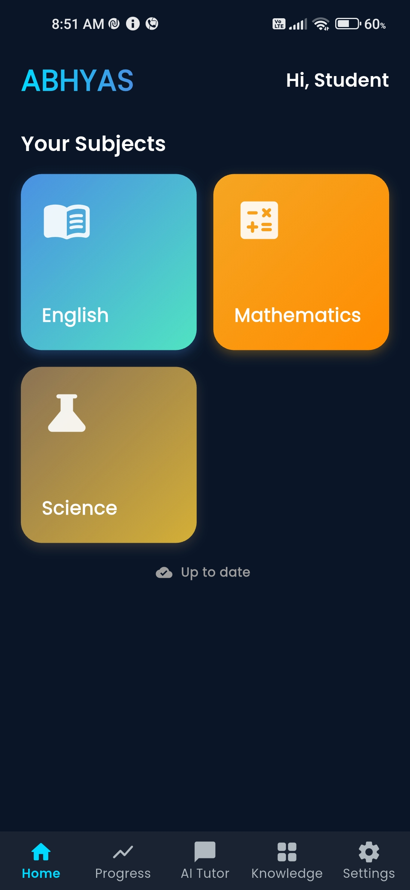 | 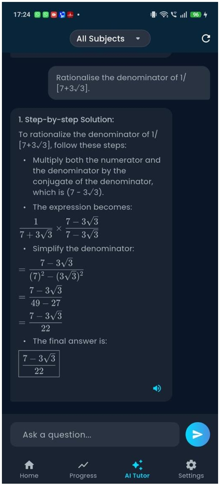 | 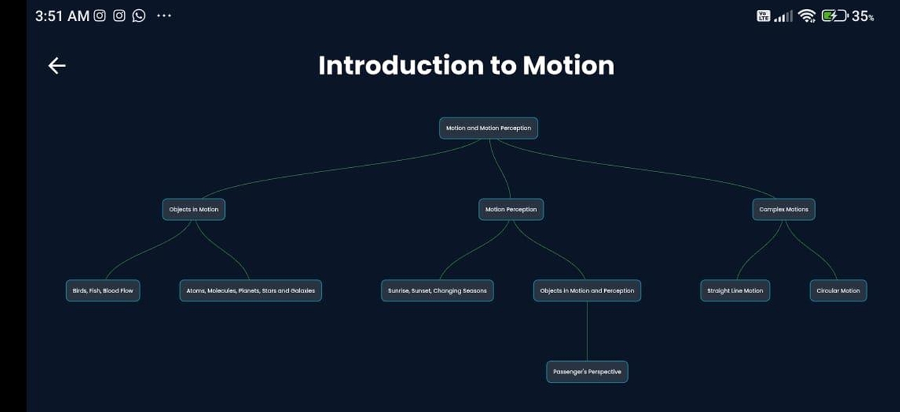 |

| Quiz                          | Summary                             | Progress                              |
| ----------------------------- | ----------------------------------- | ------------------------------------- |
| 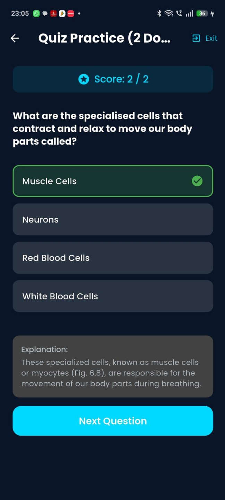 | 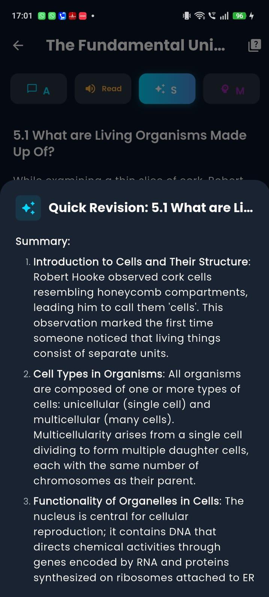 |  |

#### Additional Screenshots

| 1                                  | 2                                  | 3                                  |
| ---------------------------------- | ---------------------------------- | ---------------------------------- |
| 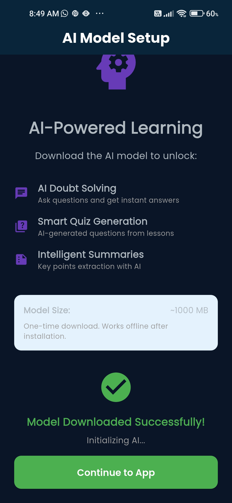 |  | 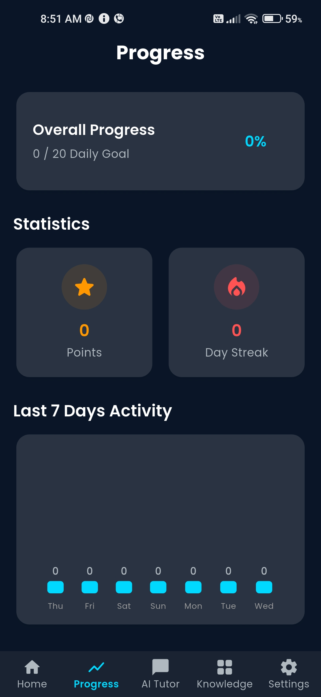 |

| 4                                  | 5                                  | 6                                  |
| ---------------------------------- | ---------------------------------- | ---------------------------------- |
| 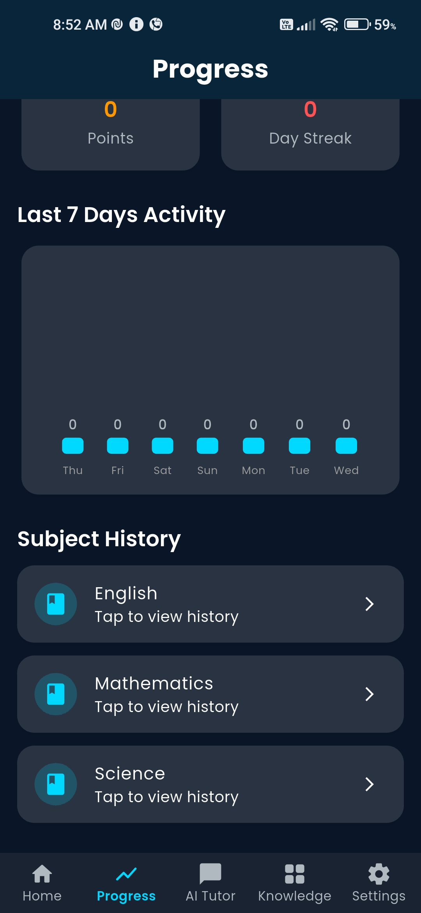 | 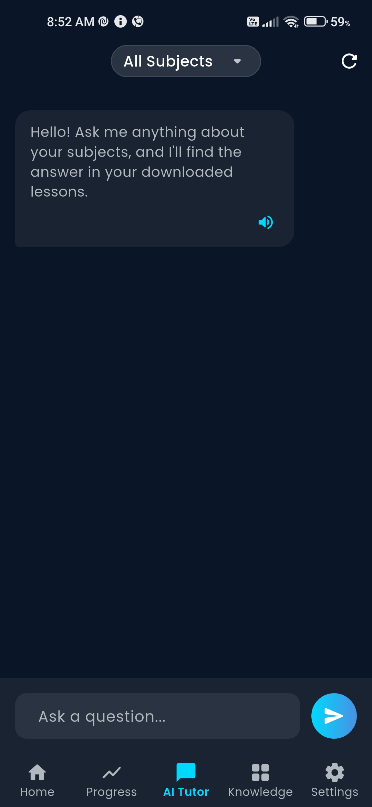 | 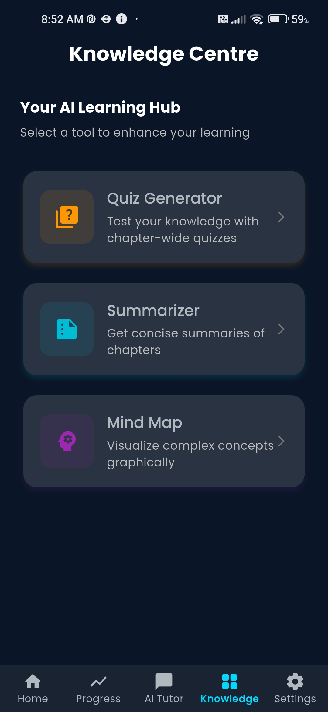 |

| 7                                  | 8                                  | 9                                  |
| ---------------------------------- | ---------------------------------- | ---------------------------------- |
| 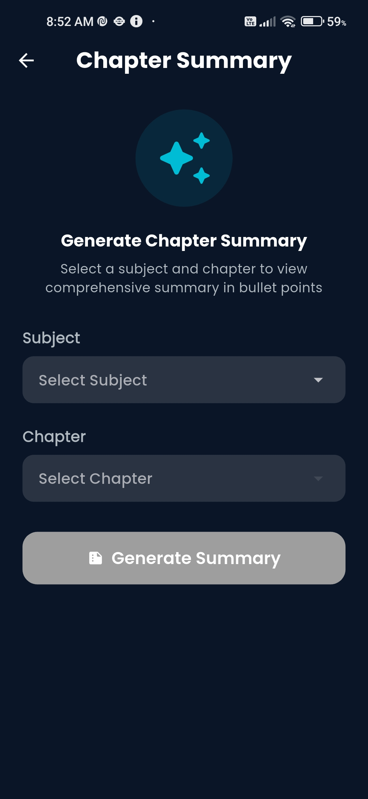 | 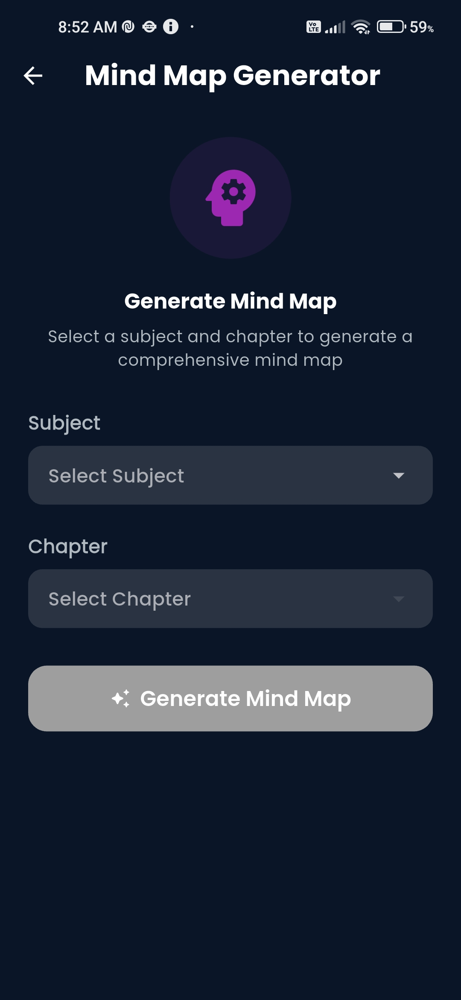 | 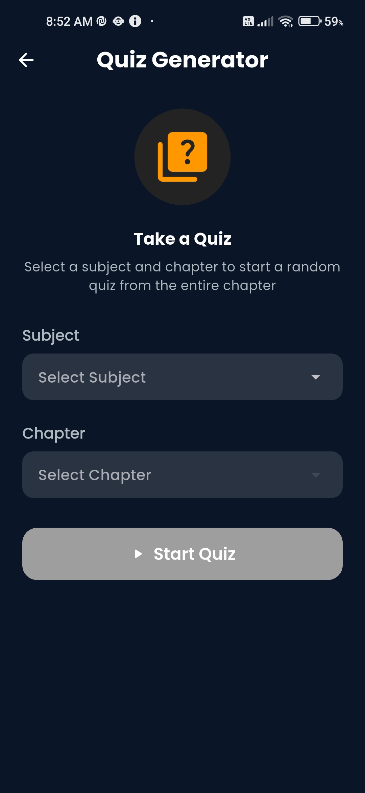 |

| 10                                   |
| ------------------------------------ |
| 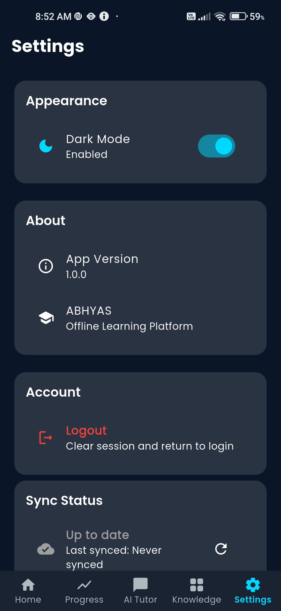 |

---

## 🏆 Achievements

- 🥇 **AI Eduthon Finals** - Shortlisted
- 📱 **100+ Beta Testers** - Positive feedback on offline functionality
- 🌟 **5000+ Training Examples** - Curated from Class 9 NCERT

---

> _Built with ❤️ by Team PAV BHAJI for the AI Eduthon._  
> _Transforming education, one device at a time._  
> **Making quality education accessible to all, anytime, anywhere!** 🌟

---

**"Education is the most powerful weapon which you can use to change the world."** - Nelson Mandela
